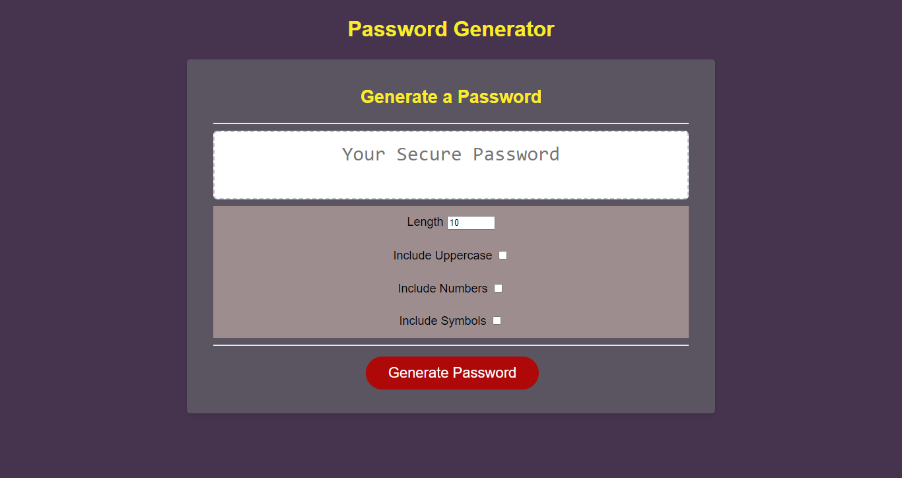
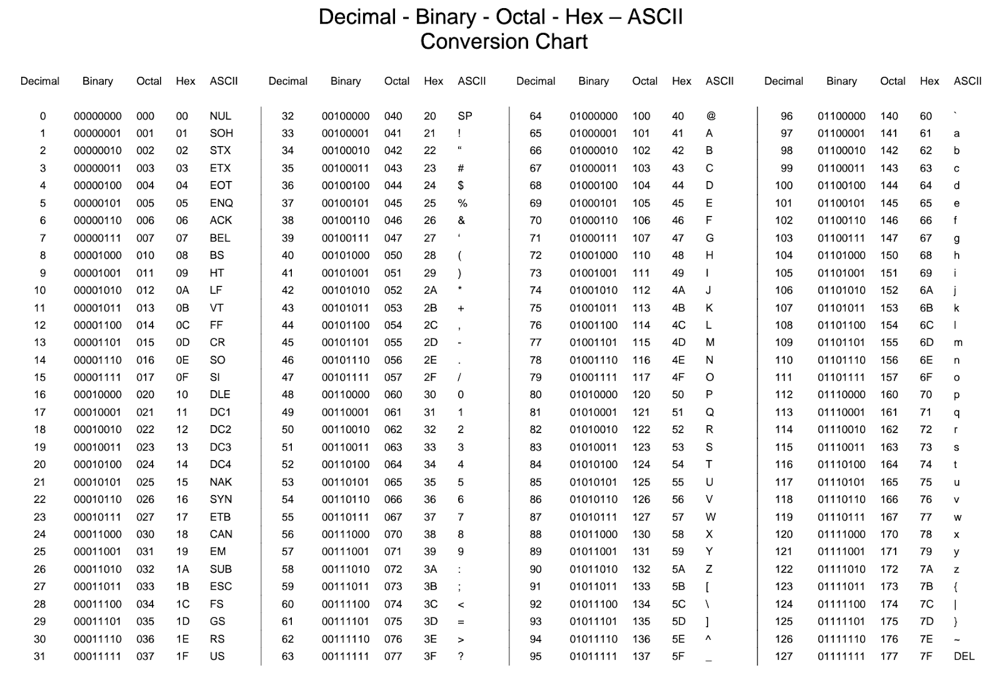

# Password Generator

Password Generator using HTML, CSS, and JavaScript only. 
The application has an area where the generated password is shown and below that we have a few options. The first one is the length that we want the password to be, it has a minimum of 8 characters, a maximum of 128, and a start value of 10 at the beginning, then we find options to add or remove uppercase characters, numbers or symbols. Then a button to generate.

All characters on our keyboard have different codes assigned to them, and these codes can be found in the ASCII table. We are going to be using the decimal value to extract each code.

## Application preview

## Link to deployed page

[https://miguel-thethird.github.io/Password-Generator-with-JavaScript-/]

### ASCII character table

